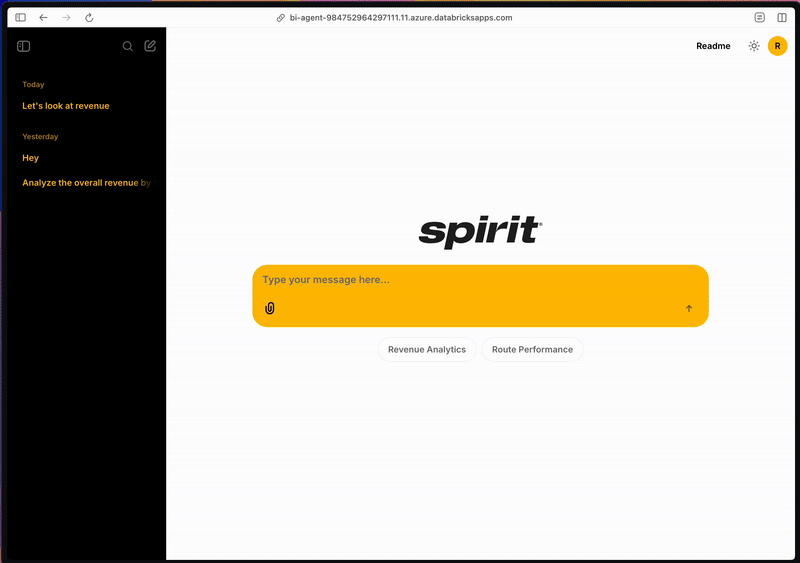
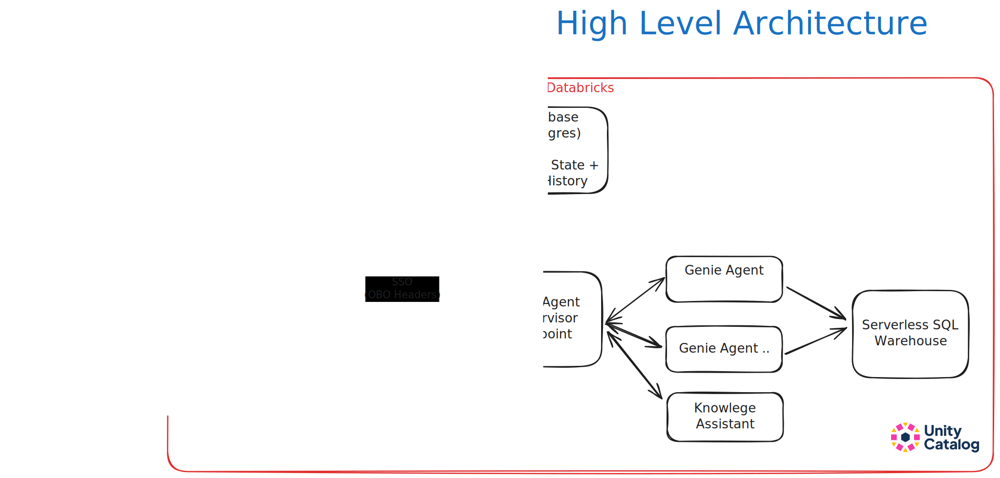
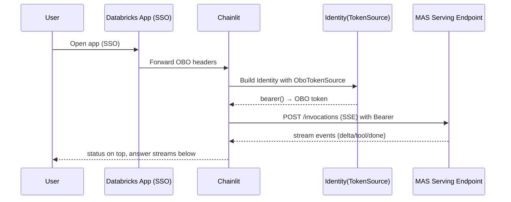
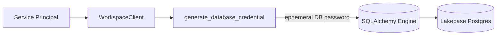

# BI Hub App — AI-Powered Business Intelligence Agent

A Databricks App built with Chainlit that provides an intelligent chat interface for BI analytics. It integrates with Multi-Agent Supervisor (MAS) for reasoning and uses Lakebase (PostgreSQL) for session state and chat history.


## Key Features

**Chainlit Implementation**
- **Persistent Chat History**: Uses Lakebase (PostgreSQL) with Chainlit Data Layer for session and chat persistence
- **Customizable UI**: Minimal Chainlit interface with easy branding customization
- **Real-time Streaming**: Responses stream directly to users for immediate feedback

**Databricks Integration**
- **Multi Agent Supervisor**: Routes queries across Genie Spaces and Knowledge Assistants for consolidated responses
- **Secure Model Access**: Leverages OBO (On-Behalf-Of) tokens to query Model Serving endpoints and Genie requests
- **Unity Catalog Integration**: Applies table, row, and column-level security through Unity Catalog permissions
- **Lakebase (Postgres)**: Stores session state and chat history 
- **Comprehensive Logging**: MAS traces logged via MLflow 3.0 and can be loaded into Delta tables





## Quick Start

**Deploy with Databricks Asset Bundles:**
```bash
git clone <repo-url>
cd bi-hub-app
# Update databricks.yml with your workspace/targets
# Update src/app/.chainlit/config.toml for branding
databricks bundle validate --profile <PROFILE>
databricks bundle deploy --profile <PROFILE>
databricks bundle run --profile <PROFILE>
# Run Job first, then App
```

**Key files to configure before deploying:**
- `databricks.yml` — workspace host, app name, database instance name, MAS endpoint
- `src/app/.chainlit/config.toml` — Chainlit settings, branding
- `src/app/public/images/logo.svg` — your logo
- `src/app/app.yaml` — app-specific names and environment variables (there's a known issue that variables can't be used in app.yaml from the bundle file)

**Local Development:**
```bash
cd src/app
pip install -r requirements.txt
# Set env vars: DATABRICKS_TOKEN, PGHOST, SERVING_ENDPOINT, etc.
chainlit run app.py -w
```

**Authentication Notes:**
- **Databricks Apps**: Uses OBO/SSO (configured via environment variables in app.yaml)
- **Local Dev**: Uses password auth + PAT (set `DATABRICKS_TOKEN` environment variable)

**What you get:**
- Streaming responses from MAS
- Tool calls in status block (above)
- Tables auto-formatted from pipe-tables
- Chat history persisted in Lakebase

## Auth & Transport (at a glance)

| Context | MAS Auth | Transport | Lakebase Auth |
|---------|----------|-----------|---------------|
| Databricks App | OBO | SSE to `/invocations` (REST) | Service Principal |
| Local Development | PAT | OpenAI Async client (`responses.*`) | Service Principal |

**Known:** OpenAI SDK + OBO can result in 403 errors ("invalid scope"). We bypass with querying the MAS endpoint directly instead of using OpenAI Client on OBO.

## What you get

- Streaming MAS responses
- Tool calls shown in a status block (always above)
- Tables auto-formatted when pipe-tables are detected
- Chat history persisted (resumable threads)

## Minimal Setup Notes

- **Chainlit config:** session timeouts, branding (`src/app/.chainlit/config.toml`, `public/logo.svg`)
- **History budget (token-safe):** keep earliest system message + last N turns + a simple char budget; append current user message
- **Lakebase:** SP → `generate_database_credential` → ephemeral DB password (cached + auto-refresh), injected via SQLAlchemy connect hook

## Troubleshooting (quick)

- **401/403 to MAS in Apps** → OBO scope/expiry or endpoint ACLs
- **"password authentication failed" to Lakebase** → SP perms/expired cred (we auto-invalidate and refresh)
- **No streaming** → ensure OBO path uses SSE (`Accept: text/event-stream`) and payload key is `input=[...]` (not `messages`)
- **Local** → set `DATABRICKS_TOKEN` (PAT) and use OpenAI client path

**Enable debug:**
```bash
export CHAINLIT_DEBUG=true
```

## Diagrams

<details>
<summary><strong>Auth init & MAS call flow</strong></summary>



</details>

<details>
<summary><strong>Lakebase credential flow (no OBO)</strong></summary>



</details>

## Requirements (brief)

- Python 3.8+
- Databricks CLI ≥ 0.267.0 (Apps)
- MAS endpoint + Lakebase instance
- `requirements.txt` in `src/app` (pinned)
