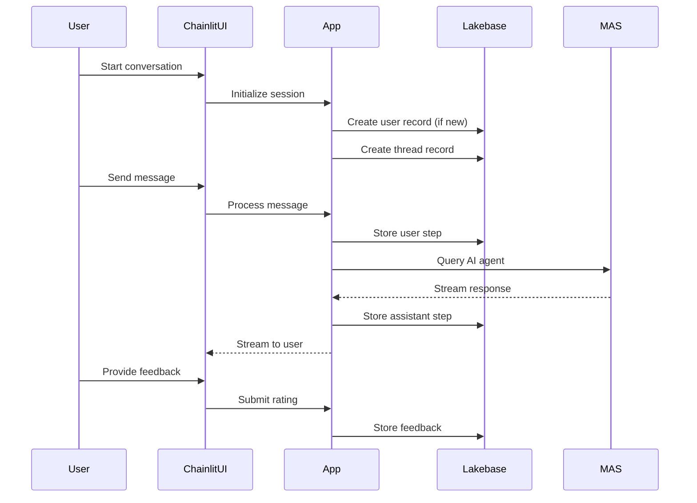

# Database Integration: Chainlit + Databricks Lakebase

This document explains how the BI Hub application uses Databricks Lakebase (managed PostgreSQL) for persistent chat storage and how Chainlit integrates with it for session management.

## Overview

The BI Hub application leverages **Databricks Lakebase** as its primary database for storing chat conversations, user sessions, and interaction history. Lakebase is a fully managed PostgreSQL service provided by Databricks that integrates seamlessly with the Databricks workspace security model.

### Architecture Components

```
┌─────────────────┐    ┌─────────────────┐    ┌─────────────────┐
│                 │    │                 │    │                 │
│   Chainlit UI   │◄──►│   BI Hub App    │◄──►│  Databricks     │
│                 │    │                 │    │  Lakebase       │
│ - Chat Interface│    │ - Session Mgmt  │    │  (PostgreSQL)   │
│ - User Input    │    │ - Data Layer    │    │                 │
│ - Streaming     │    │ - OAuth Token   │    │ - Users         │
│                 │    │   Management    │    │ - Threads       │
└─────────────────┘    └─────────────────┘    │ - Steps         │
                                              │ - Elements      │
                                              │ - Feedbacks     │
                                              └─────────────────┘
```

## Databricks Lakebase Overview

### What is Lakebase?
- **Managed PostgreSQL**: Fully managed PostgreSQL service within Databricks
- **Integrated Security**: Uses Databricks identity and access management
- **OAuth Authentication**: Leverages workspace authentication for database access
- **High Availability**: Built-in backup, monitoring, and scaling capabilities
- **VPC Integration**: Runs within your Databricks workspace VPC

### Key Benefits
1. **Zero Database Administration**: No need to manage PostgreSQL instances
2. **Unified Security Model**: Same authentication as your Databricks workspace
3. **Automatic Scaling**: Handles connection pooling and resource scaling
4. **Built-in Monitoring**: Integrated with Databricks observability
5. **Cost Effective**: Pay-per-use model with automatic optimization

## Database Schema

The application uses the standard Chainlit SQLAlchemy schema for PostgreSQL persistence:

### Core Tables

#### 1. **users** - User Identity Management
```sql
CREATE TABLE users (
    "id" UUID PRIMARY KEY,
    "identifier" TEXT NOT NULL UNIQUE,  -- User identifier from auth
    "metadata" JSONB NOT NULL,          -- User profile info (email, name, etc.)
    "createdAt" TEXT                    -- First seen timestamp
);
```

#### 2. **threads** - Conversation Sessions
```sql
CREATE TABLE threads (
    "id" UUID PRIMARY KEY,
    "createdAt" TEXT,                   -- Conversation start time
    "name" TEXT,                        -- Optional conversation name
    "userId" UUID,                      -- Foreign key to users table
    "userIdentifier" TEXT,              -- Denormalized user identifier
    "tags" TEXT[],                      -- Conversation tags/categories
    "metadata" JSONB,                   -- Custom conversation metadata
    FOREIGN KEY ("userId") REFERENCES users("id") ON DELETE CASCADE
);
```

#### 3. **steps** - Individual Messages/Interactions
```sql
CREATE TABLE steps (
    "id" UUID PRIMARY KEY,
    "name" TEXT NOT NULL,               -- Step name/identifier
    "type" TEXT NOT NULL,               -- 'user_message', 'assistant_message', etc.
    "threadId" UUID NOT NULL,           -- Foreign key to threads
    "parentId" UUID,                    -- For nested/reply messages
    "streaming" BOOLEAN NOT NULL,       -- Whether message was streamed
    "waitForAnswer" BOOLEAN,            -- If step waits for user input
    "isError" BOOLEAN,                  -- Error indicator
    "metadata" JSONB,                   -- Step-specific metadata
    "tags" TEXT[],                      -- Step tags
    "input" TEXT,                       -- User input content
    "output" TEXT,                      -- Assistant response content
    "createdAt" TEXT,                   -- Message timestamp
    "command" TEXT,                     -- Special command executed
    "start" TEXT,                       -- Processing start time
    "end" TEXT,                         -- Processing end time
    "generation" JSONB,                 -- LLM generation metadata
    "showInput" TEXT,                   -- Display input override
    "language" TEXT,                    -- Programming language for code
    "indent" INT,                       -- Display indentation level
    "defaultOpen" BOOLEAN,              -- UI expansion state
    FOREIGN KEY ("threadId") REFERENCES threads("id") ON DELETE CASCADE
);
```

#### 4. **elements** - Attachments and Media
```sql
CREATE TABLE elements (
    "id" UUID PRIMARY KEY,
    "threadId" UUID,                    -- Associated conversation
    "type" TEXT,                        -- 'image', 'file', 'video', etc.
    "url" TEXT,                         -- Element URL/path
    "chainlitKey" TEXT,                 -- Chainlit internal key
    "name" TEXT NOT NULL,               -- Display name
    "display" TEXT,                     -- Display mode
    "objectKey" TEXT,                   -- Object storage key
    "size" TEXT,                        -- File size
    "page" INT,                         -- Page number for documents
    "language" TEXT,                    -- Language for code elements
    "forId" UUID,                       -- Associated step/message ID
    "mime" TEXT,                        -- MIME type
    "props" JSONB,                      -- Element properties
    FOREIGN KEY ("threadId") REFERENCES threads("id") ON DELETE CASCADE
);
```

#### 5. **feedbacks** - User Feedback/Ratings
```sql
CREATE TABLE feedbacks (
    "id" UUID PRIMARY KEY,
    "forId" UUID NOT NULL,              -- Target step/message ID
    "threadId" UUID NOT NULL,           -- Associated conversation
    "value" INT NOT NULL,               -- Rating value (1-5)
    "comment" TEXT,                     -- Optional feedback comment
    FOREIGN KEY ("threadId") REFERENCES threads("id") ON DELETE CASCADE
);
```

## Chainlit Integration

### Data Layer Implementation

The application implements a custom Chainlit data layer that connects to Lakebase:

```python
# src/app/data/layer.py
import chainlit as cl
from .lakebase import create_chainlit_data_layer

@cl.data_layer
def get_data_layer():
    data_layer = create_chainlit_data_layer()
    return data_layer
```

### Connection Management

#### 1. **OAuth Token Authentication**
```python
# src/app/data/credentials.py
class LakebaseCredentialProvider:
    def get_credential(self) -> Credential:
        # Generates short-lived OAuth tokens using Databricks SDK
        w = WorkspaceClient()
        cred = w.database.generate_database_credential(
            request_id=str(uuid.uuid4()), 
            instance_names=[settings.pg_database_instance]
        )
        return Credential(token=cred.token, expiration_time=cred.expiration_time)
```

#### 2. **SQLAlchemy Engine with Token Injection**
```python
# src/app/data/lakebase.py
def create_chainlit_data_layer():
    data_layer = SQLAlchemyDataLayer(settings.pg_connection_string)
    
    @event.listens_for(sync_engine, "do_connect")
    def provide_token(dialect, conn_rec, cargs, cparams):
        credential = _credential_provider.get_credential()
        cparams["password"] = credential.token  # Inject fresh OAuth token
    
    return data_layer
```

### Configuration

#### Environment Variables
```bash
# Lakebase Connection Settings
DATABASE_INSTANCE=your-lakebase-instance-name
PGHOST=your-lakebase-host.databricks.com
PGPORT=5432
PGUSER=your-databricks-username
PGDATABASE=your-database-name
PGSSLMODE=require

# Databricks Authentication
DATABRICKS_HOST=https://your-workspace.cloud.databricks.com
```

#### Connection String Format
```python
# Constructed in config.py
pg_connection_string = f"postgresql+psycopg://{user}:@{host}:{port}/{database}?sslmode={sslmode}"
# Password is injected dynamically via OAuth token
```

## Security Model

### Authentication Flow
1. **User Authentication**: User authenticates with Databricks workspace
2. **Token Generation**: Application requests database credential using workspace identity
3. **Token Injection**: OAuth token injected into database connection
4. **Permission Enforcement**: Lakebase enforces workspace-level permissions

### Security Features
- **No Static Passwords**: Uses short-lived OAuth tokens (typically 1 hour)
- **Automatic Token Refresh**: Tokens refreshed automatically before expiration
- **Workspace Integration**: Database permissions tied to Databricks workspace roles
- **Audit Trail**: All database access logged through Databricks audit system
- **Network Security**: Connections encrypted with TLS/SSL

## Data Flow

### Chat Session Lifecycle



### Message Storage
1. **User Message**: Stored as `step` with `type='user_message'`
2. **AI Response**: Stored as `step` with `type='assistant_message'`
3. **Streaming**: Response built incrementally and finalized when complete
4. **Metadata**: Performance metrics, tokens, model info stored in `metadata` JSONB
5. **Attachments**: Files/images stored as `elements` linked to messages

## Performance Optimization

### Indexing Strategy
The application includes comprehensive indexes for optimal query performance:

```sql
-- Core relationship indexes
CREATE INDEX idx_threads_user_id ON threads("userId");
CREATE INDEX idx_steps_thread_id ON steps("threadId");
CREATE INDEX idx_feedbacks_thread_id ON feedbacks("threadId");

-- Temporal queries
CREATE INDEX idx_threads_created_at ON threads(CAST("createdAt" AS TIMESTAMP));
CREATE INDEX idx_steps_created_at ON steps(CAST("createdAt" AS TIMESTAMP));

-- Analytics optimization
CREATE INDEX idx_steps_type_created ON steps("type", CAST("createdAt" AS TIMESTAMP));
CREATE INDEX idx_steps_error_analysis ON steps("isError", CAST("createdAt" AS TIMESTAMP));
```

### Connection Pooling
- **SQLAlchemy Pool**: Automatic connection pooling and management
- **Token Caching**: OAuth tokens cached and reused within expiration window
- **Connection Limits**: Configurable pool sizes to prevent resource exhaustion

## Analytics and Monitoring

### Built-in Analytics Views
The application provides pre-built views for common analytics:

```sql
-- User engagement metrics
SELECT * FROM user_summary_view;

-- Conversation analytics
SELECT * FROM chat_summary_view;

-- Performance dashboard
SELECT * FROM performance_dashboard_view;
```

### Data Quality Monitoring
```sql
-- Run comprehensive data quality checks
SELECT * FROM system_health_check();

-- Validate data integrity
SELECT * FROM cleanup_orphaned_records();
```

## Maintenance Operations

### Automated Cleanup
```sql
-- Clean up conversations older than 180 days
SELECT * FROM cleanup_old_conversations('180 days');

-- Update table statistics for query optimization
SELECT * FROM update_table_statistics();
```

### Backup and Recovery
- **Automatic Backups**: Lakebase provides automated daily backups
- **Point-in-time Recovery**: Restore to any point within retention period
- **Cross-region Replication**: Optional for disaster recovery

## Troubleshooting

### Common Issues

#### 1. **Connection Errors**
```python
# Test database connectivity
from data.lakebase import test_database_connection
test_database_connection()
```

#### 2. **Token Expiration**
```python
# Force token refresh
from data.credentials import LakebaseCredentialProvider
provider = LakebaseCredentialProvider()
provider.invalidate()  # Forces new token generation
```

#### 3. **Schema Issues**
```sql
-- Verify table structure
\d users;
\d threads;
\d steps;

-- Check for missing indexes
SELECT * FROM pg_indexes WHERE schemaname = 'public';
```

### Monitoring Queries
```sql
-- Active connections
SELECT count(*) FROM pg_stat_activity WHERE state = 'active';

-- Long-running queries
SELECT query, state, query_start 
FROM pg_stat_activity 
WHERE query_start < now() - interval '5 minutes';

-- Database size
SELECT pg_size_pretty(pg_database_size(current_database()));
```

## Best Practices

### Development
1. **Use Transactions**: Wrap multi-table operations in transactions
2. **Handle Token Expiration**: Implement retry logic for token refresh
3. **Connection Cleanup**: Always close connections properly
4. **Error Handling**: Log database errors with sufficient context

### Production
1. **Monitor Performance**: Set up alerts for slow queries and connection issues
2. **Regular Maintenance**: Schedule periodic cleanup and statistics updates
3. **Backup Verification**: Regularly test backup restoration procedures
4. **Capacity Planning**: Monitor growth trends and plan for scaling

### Security
1. **Principle of Least Privilege**: Grant minimal required database permissions
2. **Network Security**: Use VPC peering and security groups appropriately
3. **Audit Compliance**: Enable and monitor database audit logs
4. **Token Rotation**: Ensure OAuth tokens rotate according to policy

## Migration and Upgrades

### Schema Evolution
- **Version Control**: All schema changes managed through migration scripts
- **Backward Compatibility**: Maintain compatibility during transitions
- **Testing**: Validate migrations in development before production

### Chainlit Upgrades
- **Data Layer Compatibility**: Verify Chainlit updates don't break data layer
- **Schema Changes**: Review Chainlit releases for schema modifications
- **Testing**: Full integration testing after Chainlit upgrades

## Support and Resources

### Databricks Documentation
- [Lakebase Documentation](https://docs.databricks.com/database/lakebase.html)
- [Database Credentials API](https://docs.databricks.com/dev-tools/api/latest/database.html)
- [Unity Catalog Security](https://docs.databricks.com/data-governance/unity-catalog/index.html)

### Chainlit Resources  
- [Chainlit Data Layer Documentation](https://docs.chainlit.io/data-layers/sqlalchemy)
- [SQLAlchemy PostgreSQL Driver](https://docs.sqlalchemy.org/en/20/dialects/postgresql.html)

### Application-Specific
- `sql/` directory: All SQL scripts, queries, and schema definitions
- `src/app/data/`: Database integration code
- `sql/setup_sql_environment.sql`: Environment verification script
